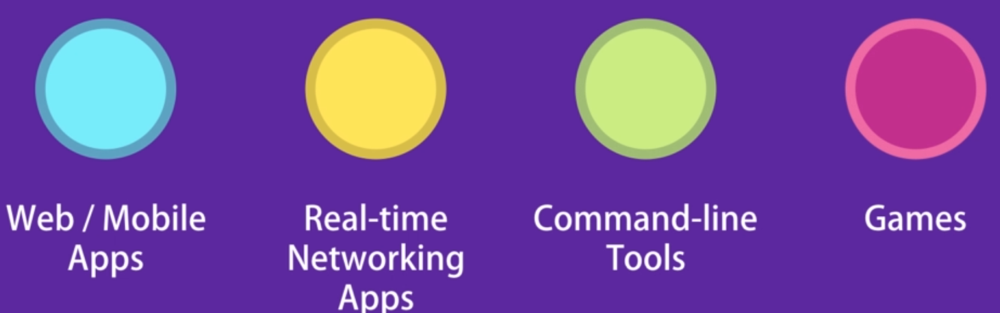
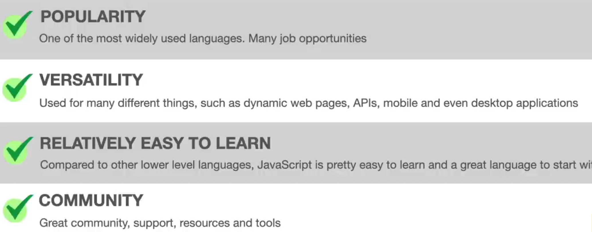
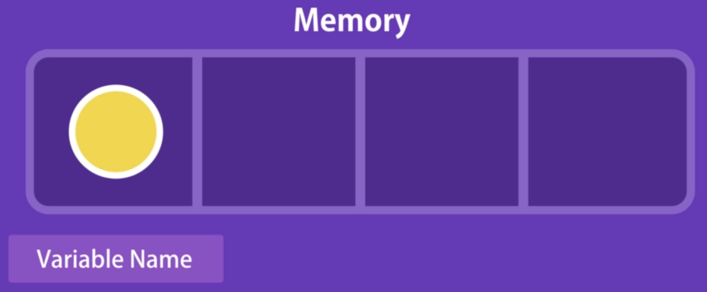
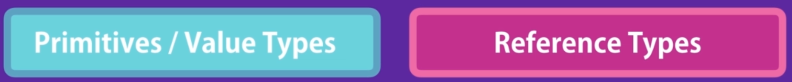
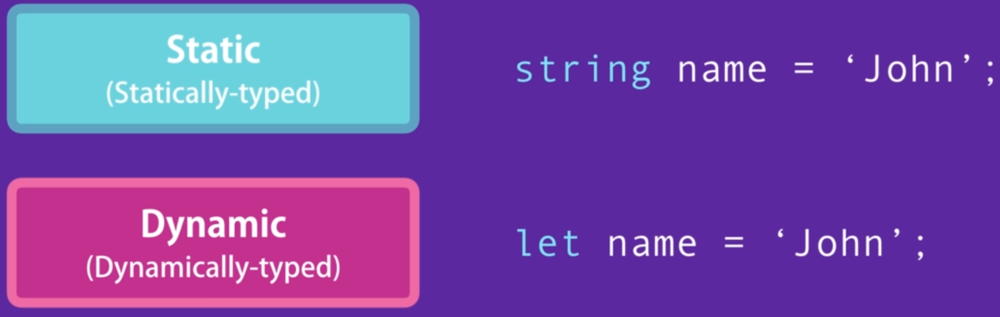
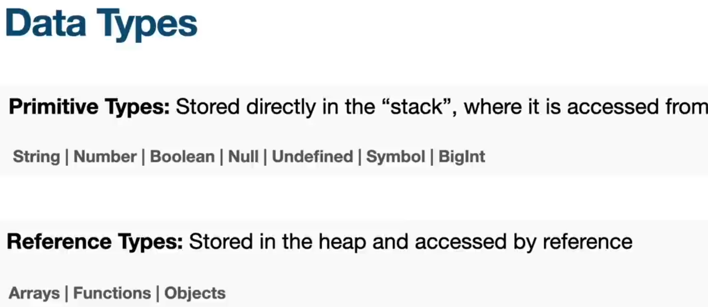
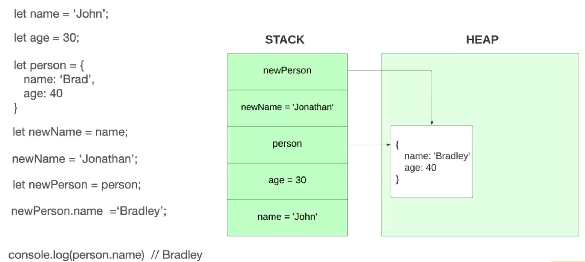
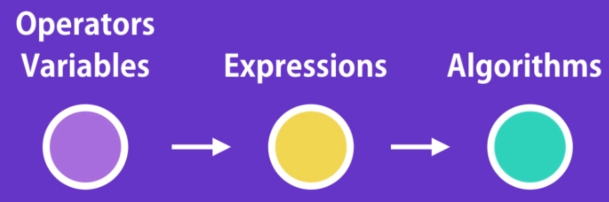
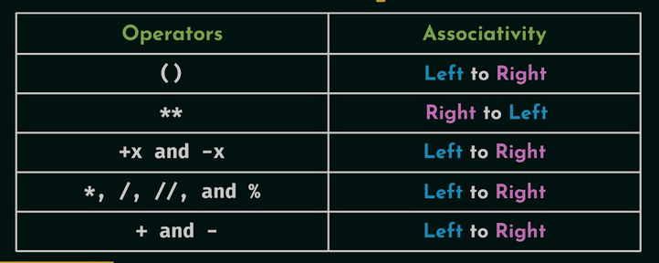

# JavaScript Course

This repository contains examples and exercises on JavaScript classes, demonstrating key concepts such as inheritance, encapsulation, constructors, and methods. Ideal for learners looking to deepen their understanding of object-oriented programming in JavaScript.

## About JavaScript

JavaScript is a versatile, high-level `interpreted` programming language that was created in `1995` by `Brendan Eich` while working at Netscape. Initially designed to add interactivity to web pages, it has evolved into a powerful tool for server-side programming, mobile app development, and game development, thanks to frameworks like `Node.js`, `React`, and `Angular`. Its rise in popularity is fueled by its ability to run natively in browsers, making it essential for front-end development and enabling the creation of dynamic, user-friendly web applications. Today, JavaScript is one of the `core technologies` of the web, alongside HTML and CSS, and is utilized by millions of developers worldwide for various applications, reflecting its immense power and flexibility in the tech industry .

### Getting Start

- What is the JavaScript?

  - It is one of the most popular and fast growing programming language in the world
  - Big companies like `Paypal`, `NetFlix`, `WallMart`, and etc. build their entire website using JavaScript
  - You can work as Front-end or Back-end or Full-Stack developer
  - JavaScript Today
  - 
  -
  - JavaScript designed to execute in browsers
  - JavaScript engin in FireFox is `FireMonkey` and in Chrome is `V8`
  - In 2009 an engineer imbedded Chrome V8 engin inside a C++ code and create Node for back-end side of programming with JavaScript

- What is JavaScript Used for?

  - DOM (Document Object Model) manipulation.
  - It can change DOM objects dynamically like changing an attribute or tag, content of a div od styles of an element
  - Event handling. It can response to clicks, drags, hovers and the like
  - Asynchronous requests. like Http request through working with backend or AJax like events
  - Animation effects
  - Data Manipulation It's full featured language for working with arrays(Sorting, filtering, etc)
  - Storing Data (Cookies, localStorage, etc)
  - Single Page Application (SPA) (no need to reload single pages)
  - Creating APIs and Web Servers (Node.js, Deno)

- Why Learn JavaScript?

  - 

- JavaScript Execution in Browser

  - Open FireFox or Chrome and inside developer tools open console and write first JS code (`alert`, `log`, `a math operation`)

- Setting Up the Development Environment

  - We can write our JvaScript code inside any text editor like notepad or Sublime. Also we can work with VSCode
  - Install `VSCode` and `Node` (It's not a Node course) for windows
  - Create essential file (`.html`) and `Live Server` for starting the project
  - Install `git` (We learn the basics)
  - Create your first JavaScript code inside your index file using `script` element
  - Put your script tag at end of the file before body closing tag as best practice
  - By placing your script tag you don't make your webpage busy or never loose any elements
  - Write your first statement between your script tags
  - Explain `console.log('Hello World!');`
  - Add a comment to your code using `//`

- Separation of Concerns

  - Create a JavaScript file and transfer all your code into it
  - In a real world application we can have lots of JS file
  - Reference your JS file in your script tag using `src="..."` attribute

- JavaScript in Node

  - Inside terminal or command prompt go to the project folder and execute JS file using this command: `node index.js`
  - Run that command inside VSCode internal integrated terminal

- Using the Console

  - Check Chrome or Firefox developer tool and show warnings in console (`Ctr+Alt+K`)
  - Also we can type JavaScript code inside console
  - Talk about `undefined` statement inside console (Also `new Date();`)
  - Use `clear()` to clean up your console (`Ctrl+L`)
  - Talk about console object and show all types(`i1`)
  - Remind the `Emmet` toolkit
  - Install `JavaScript ES6 Snippets` Extension and talk about it (`clg`, `tryc`) and all kind of console methods (`log`, `error`, `warning`, `table`) (`i6`)

- Comments and Shortcuts

  - We use `comments` for documenting code or explaining things in the human readable ways
  - Sometimes we use comments to disable code for testing
  - `//` only work on one line and we can comment a line using `Ctrl+/` keyboard Shortcut
  - Comment multiline we can use `/*...*/` of codes by selecting them and using keyboard Shortcut
  - By holding `Ctrl` and pushing `left arrow` or `right arrow` we can jump to the end or start of a line (Also `home` and `end` keys)
  - By holding `alt` and pressing `up` and `down` arrows we can move a line to the top or bottom
  - Also by holding `alt+shift` and press `down` button we can duplicate a line
  - By holding `shift+ctrl` and highlight a word we can edit all instance of that
  - We can hold `alt` and click different places and make change there altogether

### Types

- Variables

  - To save data in memory and recall it for further uses we use variables
  - This is the most fundamental concept in programming
  - 
  -
  - We cannot use a variable before initializing it (`*`) (`img7-2`)
  - Talk about the differences between `var` and `let`
  - Before ES6 we use `var` keyword to declare a variable. Now we use `let` keyword
  - Remember to terminate your codes in each line with `;` notation
  - Default value for all variable in JavaScript is `undifined` (`i2`)
  - Naming conventions for variables in JavaScript:
    - Never use `reserved keywords` (like let / check it)
    - They Should be `meaningful`
    - They cannot start with a `number`
    - They cannot contain `space` (' ') or `hyphen` ('-')
    - Typically we use `camel notation` convention in JavaScript
    - JavaScript is `Case Sensitive` language
    - We can declare multiple variable in one line and separate them using `,` notation (`*`)
    - In modern best practice we declare each variable in different line
    - Talk about different forms of naming and valid characters (`*`) (`i7-3`)

- Constants

  - When we want to have a variable that its value never change through the execution of the code until we use `constant` keyword instead of `let` (`i3`)
  - Check the error in the console when you try to change a constant value

- Primitive Types

  - In JavaScript we have two categories of types
  - 

  - In the case of primitive types, we have Five different primitive type in JavaScript : (`img4`)
    - Numbers
    - Strings
    - Booleans
    - Undefined
    - null
    - In ES6 update another primitive type named `symbol` and `Bigint` that we talk about later

- Dynamic Typing

  - JavaScript is a dynamic type language. It means you can change a variable type by assigning to new value
  - 
  - Test it in the console using `typeof` statement
  - `undefined` is actually a type also a value(`i5`)

Reference Types

- In the case of Reference types, we have three different Reference type in JavaScript :
- Object
- Array
- Function
- Notice all reference type are a kind of object (except for function - look at the documents)
- Object in JavaScript and Object in real life is completely the same
- We can put our related primitive types inside an object to reference them later
- Keys inside an object are properties of that object (`i8`)
- We can change the value of properties inside an object in two different ways (`i9`)
  - Using `Dot notation` (Is better way)
  - Using `Bracket notation`
- We can use bracket notation through the runtime and give the control it to user (`i10`)

Array

- When we want to save a list of objects or together like user selected colors, we use a data structure named `arrays`
- `[]` is array literal and we use it to collect items
- We use `indexes` to access items in an array and it starts from `0`
- Also we can add an item to an array using index system and length of array is dynamic (`i11`)
- The type of object in array is dynamic and we can assign different type of items in an array
- Arrays are a kind of object and it has lots of properties and methods (typof in console) (`i12`)
- Talk about `length` property
- When we declare a constant array or object we can change the properties of them by using `push()` method or dot notation (`i12-1`)

Function

- Functions are one of the fundamental building blocks in JS
- A function is a set of statement that perform a task or calculate a value
- Talk about how to declare a function and its structure (`i13`)
- A function can have inputs that change its behavior
- A variable that we use in a function parentheses during the definition a function is called `parameter` and it has meaning only inside the function (`img14`)
- Actual value that we give to a function is a `argument`
- We can reuse a function number of times
- Expand greet function with two variables (`i15`) and talk about undefined arguments
- Write two types of functions and initialize a variable using `return` value of calculation function (`i16,17`)
- We can pass a variable or a expression (like another function) to a function

Where they are saved?

- 
- (`i17-2`)
- 

Type Conversion (Type Casting)

- We can change a variable type to another by using these functions and methods: (`i18`)
  - `parseInt()` or `Number` to convert a string variable to an integer variable (`+`sign = unary)
  - `toString()`(its a method) or `String()` to convert an integer variable to a string variable
  - `parseFloat()` to convert a string variable to a floating point number variable variable (compare to parseInt())
  - `Boolean()` to convert a number variable to a boolean variable variable
- Check when you try to convert a character to integer (`i19`)
- Talk about `NaN` (Not a Number)

### Operators

Operators

- We use operators along with variables and constants to create expressions and with these expressions we can create logics and algorithms
- 
- We have different type of operators:
  - Arithmetic Operators
  - Assignment Operators
  - Comparison Operators
  - Logical Operators
  - Bitwise Operators

Arithmetic Operators

- We can use these mathematic operators in JS: (`i20`)
- `operand operator operand`
  - `+` for addition
  - `-` for subtraction
  - `*` for multiplication
  - `/` for division
  - `%` for remain of division
  - `**` for Exponent
  - `++` for increment (Position of operators before of after the operand is important)
  - `--` for decrement (Position of operators before of after the operand is important)

Assignment Operators

- We use `=` operator for assigning a value to a variable
- Talk about `increment` and assignment operator
- Talk about augmented assignment (`x += 5`)
- Other augmented assignment like `*=` `/=`, ...

Comparison Operators

- We use comparison operator to compare value of a variable to something else or two things (`i21`)
- Comparison operators like:
  - `>` Greater than
  - `>=` Greater than or equal
  - `<` less than
  - `<=` less than or equal
  - All above operators are `Relational` operators
  - `===` is equal
  - `!==` is not equal
  - All above operators are `Equality` operators
- Result an expression that contain a comparison operator is boolean

Equality Operators

- We have two kinds of equality operators (`i22`)
  - Strict Equality `===` (same type + same value)
  - Lose Equality `==` (same value)
  - In most of the time try to use strict equality, because it's more precise and accurate

Type Coercion

- JavaScript convert type of a value automatically in arithmetic operation between two different operand type (`i22-2`)
- JavaScript return different type in the case of `+` and `*` based on type coercion

Ternary Operators (Conditional)

- We can define a variable with conditional value using ternary operator (`i23`)
- Structure: `variable = condition ? value1 : value2`

Logical Operators

- We have three types of logical operators in JavaScript:
  - `AND` which is indicated by `&&`: It returns `true` if both operands is true (`i24`)
  - Talk about real world use case of logical operators (`i25`)
  - `OR` which is indicated by `||`: It returns `true` if on of operands is true (`i26`)
  - `NOT` which is indicated by `!`: It returns `true` it reverse the value of a logical operand (`i27`)

Logical Operators with Non-booleans

- We can use logical operators for `Non-logical` values
- `The result of a logical expression is not necessarily true ore false`
- There are all `falsy` values in JavaScript: (`i28`)
  - `undefined`
  - `null`
  - `0`
  - `false`
  - `''`
  - `NaN`
- Anything that is not falsy is `Truthy`
- Talk about Short-circuit and real example of it (`i29`)

Bitwise Operators

- It's far beyond the course but we try to cover it
- Talk about binary numbers (`8 bytes`)
- Bitwise `or` indicate by `|` (`i30`)
- Bitwise `and` indicate by `&`
- Talk about real world example related to bitwise operators (`i31`)

Operators Precedence

- Evaluation of a expression that have operators may have different result based on the order of operators (`i32`)
- 
- Parentheses have highest precedence

Exercise

- Write a piece of code that swap values of two variable (`i33, 34`)

### Control Flow

If... Else

- In JavaScript we have two kinds of conditions
  - `if...else`
  - `switch...case`
- By using if condition we can check a statement and have different kind of reactions
- The `if` structure is: `if (condition) {statement}` ('i35')
- The `if...else` structure: `if (condition) {statement1} esle if (another_condition) {statement2}`
- Work on a real world example (`i36`)

Switch...Case

- We use variables instead of conditions in using `switch...case`
- The `switch...case` structure is: `switch(variable){case value1: statement; break; case value2: statement; break; ...}` (`i37`)
- There is no limitation for using `cases`
- We can use `default` statement optionally when none of cases are true
- We can compare variables by using `switch...case` statement but in the case of booleans it's better to use `if` statement
- Using of switch...case become deprecated in new programming style

Loop

- We use loops to repeat an action for number of times
- Talk about poor way of logging something five times
- We have five kind of loops in js
  - `For` loop
  - `While` loop
  - `Do...While` loop
  - `For...in` loop
  - `For...of` loop

For Loop

- Structure: `for (initialExpression; condition; incrementExpression) {Statement}`
- `i` in for loop is `loop variable`
- Talk about the working cycle on a real example (`i38-39-40`)
- Talk about for loop indexing and different conditions

While Loop

- In for loop, loop variable is the part of the loop but in while loop we have to declare it externally
- Loop variable works only in the loop scope but while loop variable is out of the scope
- Structure: `While (condition) {Statement; increment statement}` (`i41`)
- Talk about the working cycle on a real example

Do...While Loop

- `do..while` loops are always executed at least once even th condition evaluate to false
- Structure: `do {Statement; increment statement}  while(condition) ` (`i42`)
- Show differences between while and do...while loop by an example
- In modern programming using do...while loop is not common and it's not practical

Infinite Loop

- Infinite loops can continue infinitely and cause crash for your browser or computer
- Explain it through a while loop without increment statement (`i43`)

For...in Loop

- We use for...in loop on a iterable object like array or properties of an object
- Structure: `for (variable in object) {statement}` (`i44`)
- Talk about it through an real example of array and object
- We don't use this loop for array typically (`i45`)

For...of Loop

- It is completely new in JS (After EcmaScript6)
- It doesn't need to handel indexes and the loop is over the items

Break and Continue

- If in some case we need to jump out of the loop quickly we use `break` statement
- If in some case we need to jump at beginning of the loop quickly we use `continue` statement
- continue is a king of legacy from old fashion programming in it's not common

Exercise

- `Number 1`: Write a function that takes two numbers and returns the maximum of the two (`i48-49`)
- `Number 2`: Write a function that takes width and height of a picture and define the frame of it (landscape or portrait) (`i50-51`)
- `Number 3`: Write a `fizzBuzz` function (`i52-53`)
- `Number 4`: Write a function that check a car speed and return ok if it's under a specific value (`i54-56`)
- `Number 5`: Write a function that returns all numbers till a specific number with its `Odd/Even` label (`i57-58`)
- `Number 6`: Write a function that returns number of all truthy elements inside a array (`i59-60`)
- `Number 7`: Write a function that returns all string properties inside a object (`i61-62`)
- `Number 8`: Write a function that returns the sum of all divisible numbers by 3 and 5 from 0 to a limit number (`i63-64`)
- `Number 9`: Write a function that returns the average of all scores of a student in the form of label (`i65-67`)
- `Number 10`: Write a function that gets a number and returns a triangle of stars with height of that number (`i68-69`)
- `Number 11`: Write a function that returns all prime numbers up to a limit (`70-72`)

### Objects

Basics

- Why we define objects (Highly related properties)(`i73`)
- A property of an object can be another object
- A compose of properties and functions inside an object is the refer to OOP (Object Oriented Programming)(`i74`)
- We call a function of an object, `method`

Factory Functions

- To avoid duplication and nemours bug fixing we use factory functions (`i75-78`)

Constructor Functions

- Naming convention for defining a constructor function is different (`i79`)
- We use `Pascal` notation instead of `Camel case` notation
- We use this statement to initialize an object instead of returning it
- In JS objects are dynamic
- We use `new` statement to define a new object in this method
- By using new three actions are happen
  - Creating and empty object
  - Pointing methods and properties to the empty object
  - Return new object
- To recap,Talk about the differences between two methods
- The second method is old fashion (C++, Java)

Dynamic Nature of Objects

- We can always add or remove a property or method from objects anytime (`i80`)
- We cannot reassign an object (`=`) because of `const` statement

Constructor Property

a- Every object in JavaScript has property called `constructor` (`i81-83`)

- This property references to the function that create that object
- Talk about other kinds of objects like strings in js

Functions are Objects

- Actually functions in JS is a kind of object and by using dot notation we can see all methods and properties which related to a function (`i84-85`)
- We can use `call` and `apply` methods on our function to pass the variables
- If we never use `new` statement for definition of an object it refers to global constructor object which is `window`

Value vs Reference Types

- Actually in JavScript we have two types of values: Primitive and Objects (`i86-92`)
- Variables store independently in JS but objects store in another place (reference)
- Local variables are the best example of separation of the stor location related to two different variables
- Remember that primitives are copied by their values but Objects are copied by their reference

Enumerating Properties of an Object

- Typically we use `for...in` loop to iterate over an Object properties (`i93-94`)
- An object is not iterable and you cannot use `for...of` loop over it. It works only with arrays and maps
- By using `keys()` and `entries()` methods we can use for...of loop over an object
- Talk about their functionality and performance
- We can use `in` operator to check the existence of a property in an object

Cloning an Object

- By using a simple for loop we can assign all properties of an object to another (`i95-96`)
- Also by using `assign()` method we can do the same thing like above
- `Spread` operator (`{...}`) is the third way of assigning an object to another

Garbage Collection

- We don't need to allocate and de-allocate memory to an object in JavaScript (Like C++ and Java)
- JavaScript engin has something called `Garbage Collector` which is doing that for use

Math

- Search JavaScript Math module in Google
- Talk about the document and use some Math module methods (round, max, min,...)

String

- We have two types of string in JS: `String Primitive` , `String Object`
- Any time when we use dot notation for an string JS engin wraps that to an object string automatically
- Search for JavaScript strings in Google (`i97-100`)
- Talk about scape characters

Template Literals

- It's better to use template literal to present strings in JS (`i101-103`)
- Talk a out other Literals
- Another benefit of using template literal is ability of using `placeholders`

Date

- We can use Date Object in JS in 6 different ways (`i104`)
- Using this object without any argument returns current date time
- To find all possible formats for string value in Date object it's better to read documentation (JavaScript date in Google)
- Use `toDateString()` method to convert date to string

Exercise

- `Number 1`: Create an address object with three properties and a function which returns all properties and their values of this object(`i105`)
- `Number 2`: Create address object using factory function and constructor function(`i106-107`)
- `Number 3`: Write two functions that check equality and resemblance of two different object(`i108-110`)
- `Number 4`: Write a Blog post object(`i111-112`)
- `Number 5`: Write a constructor function for our Blog post object(`i113`)

### Arrays

Introduction

- In this part of the course we try to learn how to do different operations over arrays like adding, finding, removing, splitting, and combining

Adding Elements

- We cannot reassign an constant array to a new value (`i114-115`)
- By using `.push()` method we can add a value or a list of values to the `end` of an array
- By using `.unshift()` method we can add a value or a list of values to the `beginning` of an array
- By using `.splice()` method we can add a value or a list of values to the `middle` of an array

Finding Elements (Primitives)

- By using `.indexOf()` method we can Find a value in our array
- If that element doesn't exist it returns `-1`
- Also by using `.lastIndexOf()` method we can Find the last repetition of a value in our array
- Instead of all checking index of an elements we can use `.include()` method
- Talk about the condition for if statement
- Second parameter in all methods we talk about is the first index that we want to our search begin

Finding Elements (Reference Types)

- `.include()` doesn't work on reference types (because of two different references) (`i118-119`)
- We can `.find()` method. Search for it in Google
- This method returns an Item or `undefined` (if it doesn't find anything)
- Also We can `.findIndex()` method. This method returns index of item or `-1`
